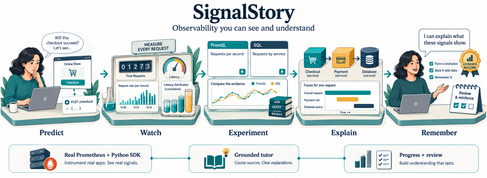
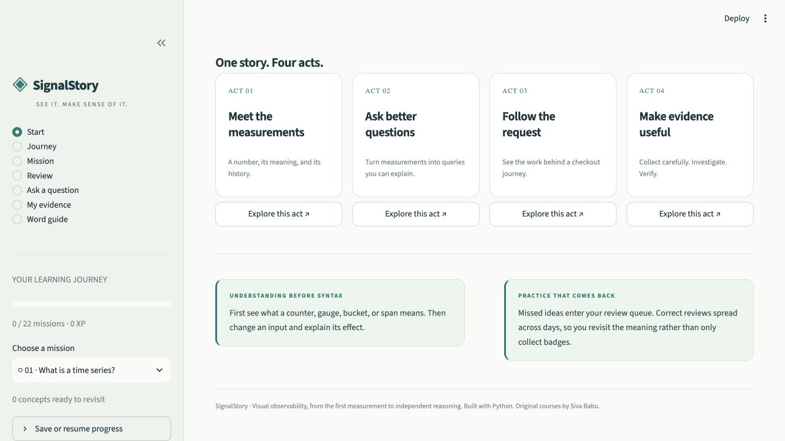
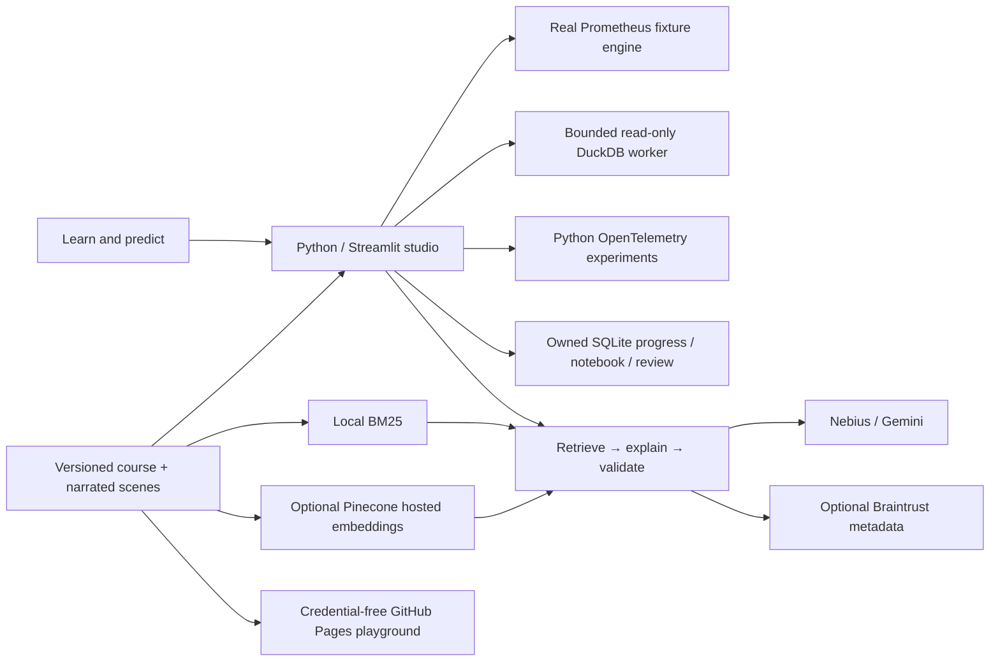

# ◈ SignalStory

**Understand the signal. Own the story.**

A visual learning studio that connects PromQL, SQL thinking, and OpenTelemetry through one checkout journey. Start with a number and its meaning. Build toward queries, request traces, careful collection, and incident investigation.

**[Try the visual playground](https://sivalinb.github.io/signalstory/)** · [Run the Python studio](#run-the-python-studio) · [Learning map](#one-story-four-acts) · [Validation](docs/validation.md)



*Conceptual illustration created with the built-in imagegen tool. The application contains the runnable queries, measured SDK evidence, and exact calculations.*

## A learning loop you can see

1. **Predict.** Commit to an answer before seeing what happens. A wrong prediction becomes a review opportunity.
2. **Watch.** Play, pause, scrub, or step through a narrated visual explanation. Change selected inputs and follow the arithmetic. A written version is available for every animation.
3. **Experiment.** Run real PromQL against reproducible measurements; compare a SQL example in DuckDB. Collect actual spans, metrics, and logs with the Python OpenTelemetry SDK.
4. **Explain.** Keep a private notebook in your own words. Ask an optional grounded AI tutor for a detailed explanation with course evidence.
5. **Remember.** Revisit concepts over increasing intervals. Pass five questions with at least 80% **and** satisfy the practical goal in both scenarios to earn a mission badge.

The public playground provides all 70 illustrated concepts, prediction checks, browser-local notes, and shareable lesson links. The Python studio adds the real engines, practical assessments, private progress, badges, spaced review, and optional tutor.



## One story, four acts

| Act | Missions | What you learn |
| --- | --- | --- |
| Meet the measurements | 1–3 | Values, units, samples, time series, labels, counter resets, gauges, observations, cumulative buckets, histogram components |
| Ask better questions | 4–11 | Selectors, windows, `rate`, `irate`, `increase`, functions over time, aggregation, ratios, vector matching, missing data, p95, cardinality, alerts, SLOs and burn rate |
| Follow the request | 12–17 | Programs and services, three signals, spans, context, `traceparent`, resources, instrumentation, SDK metrics, correlated logs and errors |
| Make evidence useful | 18–22 | Collector configuration, batching, memory limits, sampling, privacy, cardinality, N+1 queries, investigation and recovery |

**22 missions · 70 concepts · 317 narrated moments · 132 assessment questions · 70 prediction checks.** All lessons and experiments are open to preview; assessment progression is sequential. Each first mission pass earns 100 XP. Badges are educational practice evidence, not accredited certification.

There is no universal SQL-to-PromQL translator here. Each SQL connection explains where the analogy helps and where semantics differ: series identity, time windows, counter resets, missing values, and histogram estimation matter.

## Run the Python studio

Requires Python **3.11–3.13**, macOS or Linux, and internet for the initial dependency and official Prometheus download. Windows learners can use Docker or WSL.

```bash
git clone https://github.com/sivalinb/signalstory.git
cd signalstory
python3 scripts/bootstrap.py
```

Open **http://127.0.0.1:8530**. The bootstrap creates `.venv`, installs pinned dependencies, verifies the official Prometheus archive checksum, seeds the synthetic measurements, and starts the app. No API keys are needed for the curriculum, animations, query labs, assessments, or course guide.

Already have an environment?

```bash
python3 -m venv .venv
source .venv/bin/activate
pip install -r requirements.txt
python -m scripts.engine_setup
streamlit run app.py
```

Docker alternative:

```bash
docker compose up --build
```

This binds the app to localhost and persists progress in a Docker volume. The fixture Prometheus listens only inside the container on loopback. See [deployment](docs/deployment.md) before operating a shared server.

## Optional AI, with a useful fallback

```bash
pip install -r requirements-ai.txt
cp .env.example .env
# Add your own provider keys to .env, never to Python or browser code.
python -m scripts.index_lessons  # optional: creates a dedicated Pinecone index
```

| Service | Role |
| --- | --- |
| Nebius Token Factory | Primary detailed tutor; configurable OpenAI-compatible chat model |
| Gemini | Secondary tutor when the primary output fails validation or is unavailable |
| Pinecone | Integrated hosted embeddings for the 70 public course excerpts; combined with local BM25 retrieval |
| Braintrust | Metadata-only tutor monitoring: question hash, concept ID, response mode, citation IDs, latency and token usage |
| LangGraph | Explicit retrieve → explain → validate flow, with no action tools |

Without cloud retrieval, BM25 works locally. Without an accepted model response, the authored course guide remains available. The tutor uses structured output, checks cited concept IDs, removes remote image/HTML markup, and applies targeted misconception and numerical-evidence checks. **Numeric worked examples come from the authored course**, rather than newly invented model calculations. Citation validity does not prove that every AI statement is correct; inspect the evidence and use the real labs.

The default allowance is eight AI questions per profile per UTC day and 80 across one server. Anonymous profiles are not abuse-proof identity. The global cap bounds that server's call count; it is not a dollar budget. Public hosting needs operator-owned cost controls. The static playground makes no AI calls.

## What runs under the pictures



Prometheus evaluates 6,100 repeatable synthetic samples in normal and incident scenarios. SQL runs a restricted `SELECT` against the `samples` and `snapshot` tables in a short-lived process with a clean environment and output/time limits. This process is **not** a hostile-code isolation boundary.

The studio's SDK experiments measure real timestamps in logical checkout, payment and database services within one Python process. Collector lessons generate and validate YAML; they do not imply that a Collector has received it. For actual HTTP propagation, a real SQLite query and optional OTLP export, run:

```bash
python -m scripts.http_demo
python -m scripts.http_demo --failure
# Optional, with your own running Collector:
OTEL_EXPORTER_OTLP_TRACES_ENDPOINT=http://127.0.0.1:4318/v1/traces python -m scripts.http_demo
```

[examples/collector.yaml](examples/collector.yaml) is a starter configuration. The automated export test decodes real OTLP protobuf at a local HTTP receiver; it does not substitute for running an official Collector in your deployment.

## Check the product

```bash
pip install -r requirements-dev.txt
python -m scripts.engine_setup
pytest -q
node --test tests/animation_math.test.js
ruff check .
python -m scripts.evaluate_tutor        # authored guide; no funded generation
python -m scripts.evaluate_tutor --live # optional provider credits
python -m scripts.build_preview
```

Tests cover every mission's authored solution in both scenarios, executable SQL connections, reset and label semantics, SDK context and remediation, actual HTTP/OTLP propagation, owned progress, idempotent badges, concurrent quotas, honest spaced review, query restrictions, tutor fallback, animation arithmetic, and the Streamlit prediction-to-badge journey.

Read the [fresh graduate learning review](docs/learner-review.md) and try the [independent capstone](docs/capstone.md). Passing the course establishes practice within its scope; production observability expertise also requires working on unfamiliar systems. No human learner study or retention improvement claim has been made.

## Built from the Zero to Hero family

SignalStory is a dedicated product by **Siva Babu**. The PromQL and OpenTelemetry curriculum and bounded lab foundations were adapted from [promql-zero-to-hero](https://github.com/sivalinb/promql-zero-to-hero) and [opentelemetry-zero-to-hero](https://github.com/sivalinb/opentelemetry-zero-to-hero). It adds a shared story, professional visual studio, predictions, notebook, spaced reviews, hosted semantic retrieval, metadata monitoring, and a public playground.

Original course source references stay attached to each lesson, including [Prometheus](https://prometheus.io/docs/) and [OpenTelemetry](https://opentelemetry.io/docs/). Implementation and authored curriculum: [MIT license](LICENSE). Prometheus binaries are downloaded from the official release and retain their upstream license; they are not committed here.
